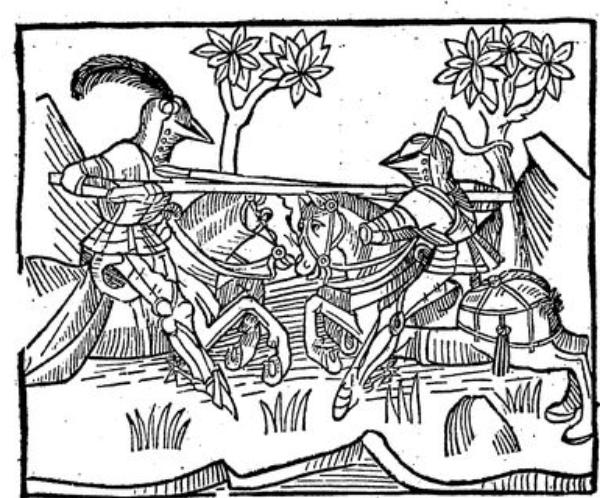

Normes de transcription
====

# Mise en pages

La majorité des choix de transcription ont été discutés sur les issues ou ont suivi [le guide paléographique d'Ariane Pinche](https://hal.science/hal-03697382/)

## Paragraphes

Les paragraphes sont indiqués dans notre monographie imprimées par des pieds de mouche noirs. Ils ont été transcrits par le caractère ¶ 

# Règles de transcription
## Lettres ramistes *u/v* et *i/j*

A l'intérieur des mots, les lettres *u* et *v* ne sont pas distinctes, comme ici dans le cas de *chevalier* et *tous* :

 

En position initiale, le *u* et le *v* prennent la même valeur avec une forme particulière que nous avons choisi de distinguer : 

 

De même, en position initiale, les caractères ayant valeur de *i* ou *j* suivent la même graphie, comme ici avec *jehan* :

## *S* longs et *s* ronds. 

Nous avons choisis de représenter la distinction entre les *s* longs et les *s* ronds. Ci-dessous deux exemples avec ces lettres :

 

## *b*
Le *b* prend deux graphies dans le texte, une avec une barre droite et l'autre avec une boucle. Nous avons choisi de garder une seule graphie pour représenter ces deux lettres : "b"

## *d*

Le "d" a une graphie particulière dans le texte que nous avons choisi de signaler par le signe suivant : 

 

## *r rotunda*

Le *r* prend deux graphies dans notre texte. Nous avons choisi de distinguer sa variation *rotunda*, utilisé quand le *r* suit une lettre arrondie, ici après un "o". 

## *z*

Le *z* prend lui aussi une graphie particulière dans notre texte. Nous avons choisi d'indiquer cette variation.

## Séparation des mots

Les mots sont séparés de manière claire dans le texte, nous avons donc suivi cela. Dans certain cas, une césure est marquée par un trait de suite. Ce trait est noté de gauche à droite et de bas en haut. Nous avons donc utilisé un trait penché dans cette direction pour le représenter dans notre transcription. Ci-dessous un exemple de césure pour le mot "souvent" (avec *s* long) : 

## Abréviations

Nous avons choisis de suivre les abbréviations présentes dans le texte. Pour cela, nous nous sommes appuyé sur , proposé par le Carnet de l'Institut de Recherche et d'Histoire des Textes. Ainsi, différents signes spéciaux ou lettres sont utilisés pour représenter un ensemble de lettres. 

Les lettres "pro" sont représentées par un p dont la barre est bouclée. Dans notre cas, ce signe apparaît pour le mot "prochain" noté ainsi : 

Les lettres "ou" ou "ous" sont représenté par le signe suivant : 

. 

Avec la lettre *u* initiale pour le *v* et le signe abbréviatif qui permet d'indique "ous" ce qui donne le terme "vous". 

Le nom de Bertrand du Guesclin est lui aussi parfois abrégé. Ainsi, il peut être indiqué par un *b* minuscule entre deux point ou par un *B* majuscule entre deux point. 

 

Le q tilde est largement utilisé dans notre texte en tant qu'abbréviation de "que" ou "qu'". 

## Accentuation et lettres pointées

Le tilde est beaucoup utilisé dans le texte. Représenté par un trait droit proche du macron, nous avons décidé de le représenter par un tilde (cf. [issue 3](https://github.com/asalva15/HN-2022--PROJET-DU-GUESCLIN--/issues/3))
La plupart des voyelles prennent le tilde dans notre document (excepté le u) :

a tilde : 

e tilde : 

i tilde : 

o tilde : 

## Ponctuation et nombres

Nous avons suivi la ponctuation présente dans la monographie imprimée. Elle est notamment indicative des abbréviations (cf. Bertrand) et des chiffres. En effet, les chiffres sont encadrés par deux points, qu'ils soient écrits en lettres ou en chiffres romains. 

 

## Éléments matériels du texte

Le texte est aussi composé d'éléments matériel tels que de signatures, des illustrations ou de tampon. 

En bas de certaines page, on trouve des signatures en chiffres romains. Ces signatures sont des indications matérielle pour l'imprimeur et le relieur, elles permettent d'indiquer l'ordre des pages. 

Sur les pages 5 et 7, nous trouvons deux illustrations des batailles dont il est fait le récit dans le texte. 

 

 
