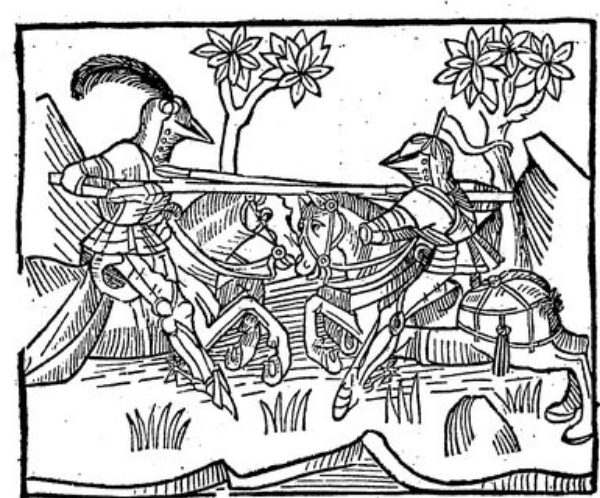

# HN-2022-Du_Guesclin
Dépôt projet de groupe - eScriptorium - Le Livre des faits de messire Bertrand du Guesclin
====

Notre projet se concentre sur *Le Livre des faits de messire Bertrand du Guesclin*, plus précisément sur une édition de 1487, disponible sur [Gallica](https://gallica.bnf.fr/ark:/12148/bpt6k1110614/f5.item) sous la [notice suivante](https://catalogue.bnf.fr/ark:/12148/cb33258730z), en caroline gothique, le texte est imprimé.

Le passage concerné occupe les folios 1 (carré noir) à 9 (*fort*), soit 16 colonnes, à savoir:
- [folio 1](https://gallica.bnf.fr/ark:/12148/bpt6k1110614/f5.item)
- [folio 2](https://gallica.bnf.fr/ark:/12148/bpt6k1110614/f6.item)
- [folio 3](https://gallica.bnf.fr/ark:/12148/bpt6k1110614/f7.item)
- [folio 4](https://gallica.bnf.fr/ark:/12148/bpt6k1110614/f8.item)
- [folio 5](https://gallica.bnf.fr/ark:/12148/bpt6k1110614/f9.item)
- [folio 6](https://gallica.bnf.fr/ark:/12148/bpt6k1110614/f10.item)
- [folio 7](https://gallica.bnf.fr/ark:/12148/bpt6k1110614/f11.item)
- [folio 8](https://gallica.bnf.fr/ark:/12148/bpt6k1110614/f12.item)
- [folio 9](https://gallica.bnf.fr/ark:/12148/bpt6k1110614/f13.item)

# Contenu du dépôt
- `Clavier/` contient le document .json utilisé contenant les caractères utilisés sur eScriptorium. 
- `exports_finaux_zip/` : les fichiers zip des pages transcrites, en fonction du membre du groupe responsable, avec les images et les encodages xml, importables dans eScriptorium (_METS(URI/ZIP)_)
- `exports_finaux_txt/` : les fichiers txt de ces pages, en fonction du membre du groupe responsable, et un fichier _.txt_ global des folios 1 à 9
- `exports_finaux_xml/` : les encodages xml et les images des pages transcrites, en fonction du membre du groupe responsable
- `img/` contient :
   - `caractères/`des caractères pour illustrer `normesTranscription.md`.
   - `illustrations/` les illustrations présentes dans nos documents.
- `rapport/` contient le rapport du projet au format `.pdf`, ainsi qu'un sous-dossier `source/` contenant le fichier `.tex` et les images utilisées dans le rapport. 
- `normesTranscription.md` : description des normes de transcription que nous avons choisie d'utiliser dans le projet.

# Auteurs
Ce projet a été réalisé par :

- Lise Bernard
- Axël Le Boulicaut
- Charlie Lézin
- Axelle Salvador

 dans le cadre du master Humanités Numériques de l'[Ecole Nationale des Chartes](https://www.chartes.psl.eu/).
